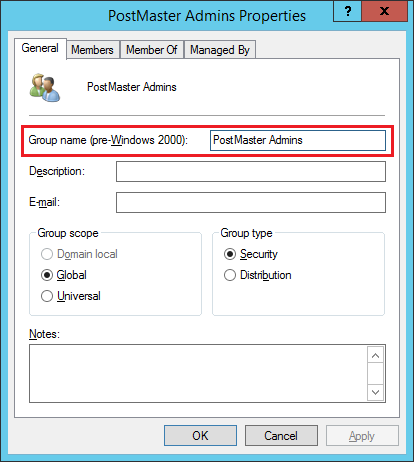

**Minimum Password Length** specifies the minimum password length that all mail users and administrators must adhere to.

**Account Lockout Threshold** specifies the number of failed login attempts a local account must make before being locked out.
To disable account lockouts, set this value to 0.

**Account Lockout Duration in Minutes** specifies the amount of time an account will be locked out for.

**Reset Account Lockout Counter in Minutes** determines how long a bad password attempt will count towards a lockout.
As an example, this value is set to 30, and an administrator entered an incorrect password twice; then the administrator returned 30 minutes later to try again,
the two failed password attempts would no longer count because the configured 30 minutes would have elapsed.

**Login Auditing** determines whether login and logout events are recorded in the log file.

**Mail Database Auditing** determines whether changes to domains, users, aliases, administrators, and configuration settings should be recorded in the log file.

**Enable LDAP Authentication** determines whether Active Directory LDAP authentication is turned on or off. In order to enable LDAP authentication,
the "AD Server LDAP String", "AD Domain", and "AD PostMaster Group" must be configured.

**AD Server LDAP String** specifies the LDAP string used to connect to Active Directory. For instance, if you are using LDAPS and you have a Domain called postmaster.local,
you can specify "LDAPS://postmaster.local:636", since postmaster.local should be a round robin to all of your Domain Controllers. You can also chose to target a specific Domain Controller
such as "LDAPS://dc1.postmaster.local:636". Although not recommended, you can also use LDAP without SSL by specifying something like "LDAP://postmaster.local".

**AD Domain** specifies the fully qualified domain name of your Active Directory Domain (i.e. postmaster.local).

**AD PostMaster Group** specifies the Active Directory group name that Active Directory users must be a member of in order to be an administrator of PostMaster.
This setting's value must be the same as the "Group name (pre-Windows 2000)" value of the desired group as shown in the screenshot below.

